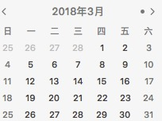

#### 问题描述

生成当月的日期列表，效果图入下:



#### 输入

```js
"2018-05-02"
```

#### 输出

[[7 个对象], [7 个对象], [7 个对象], [7 个对象], [7 个对象]]

对象数据:
```js
{
    date: 3,
    month: '4',
    day: '周三',
    isToday: true,
    fullDate: '20170101'
}
```

#### 方案

```js
  function getDateStr(date, separate = '') {
    const month = `0${(date.getMonth() + 1)}`;
    const today = `0${date.getDate()}`;
    return [date.getFullYear(), month.slice(-2), today.slice(-2)].join(separate);
  }

  function formatDate(date, currentStr) {
    const WEEK_LIST = ['周日', '周六', '周五', '周四', '周三', '周二', '周一'];
    const fullDate = getDateStr(date);
    return {
      day: WEEK_LIST[date.getDay()],
      date: date.getDate(),
      month: date.getMonth() + 1,
      isToday: fullDate === currentStr,
      fullDate,
    };
  }

  function generateMonthList(date) {
    // 结果对象
    const result = [];

    // 开始日期字符串
    const beginDateStr = `${date.replace(/(\d{2})$/, '01')} 00:00:00`;
    // 开始日期对象
    const beginDateObj = new Date(beginDateStr);
    // 年
    const currentYear = beginDateObj.getFullYear();
    // 月
    const currentMonth = beginDateObj.getMonth();
    // 结束日期对象
    const endDateObj = new Date(currentYear, currentMonth + 1, 0);

    // 上个月
    for (let i = 0; i < beginDateObj.getDay(); i += 1) {
      const prevDateObj = new Date(currentYear, currentMonth, -i);
      result.unshift(formatDate(prevDateObj));
    }

    // 当前月
    let currentTime = beginDateObj.getTime();
    const endTime = endDateObj.getTime();
    while (currentTime <= endTime) {
      const currentDate = new Date(currentTime);
      result.push(formatDate(currentDate, date.replace(/-/g, '')));
      currentTime += 24 * 3600 * 1000;
    }

    // 结束星期
    const start = endDateObj.getDay();
    for (let i = 1; i < 7 - start; i += 1) {
      const nextDateObj = new Date(currentYear, currentMonth + 1, i);
      result.push(formatDate(nextDateObj));
    }

    const data = [];
    for (let i = 0, len = result.length; i < len; i += 7) {
      data.push(result.slice(i, i + 7));
    }
    console.log(data);
  }
  generateMonthList('2018-05-02');
```
